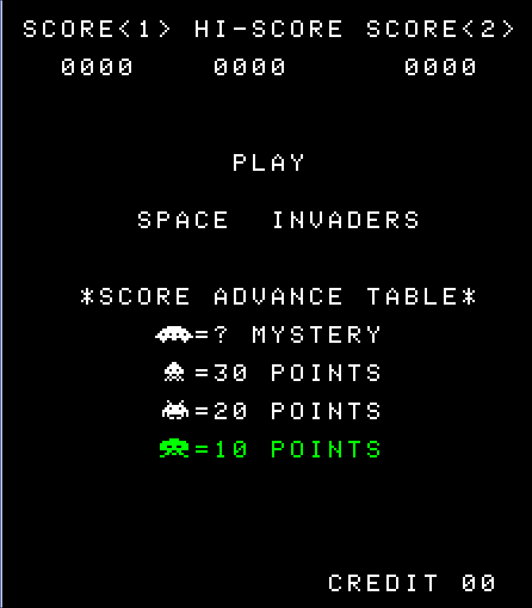

# zoctante

Yet another Space Invaders emulator, including yet another 8080 emulator written in C.

> 8080 = deux octantes = 2 zoctantes



# Features

- Full emulation of the Intel 8080 that passes all the available test roms
- Colour graphics (can switch to black and white)
- Inputs
- Sounds (from audio files)
- Automatic saving of the high score upon exit
- Speed control

# How to run it

Put the space invaders rom into the [rom](./roms/) folder. See [instructions](./roms/README.md).

After that run the following from the root directory to build the executable.
```bash
cmake -S . -B build/ -D CMAKE_BUILD_TYPE=Release
cmake --build build
```
And finally run it with
```bash
./zoctante
```

# Controls

| Keyboard | Space Invaders                                 |
| -------- | ---------------------------------------------- |
| tab      | play/pause                                     |
| esc      | quit                                           |
| c        | insert a coin                                  |
| 1        | start a game in one-player mode                |
| 2        | start a game in two-player mode                |
| left     | move the player left                           |
| right    | move the player right                          |
| space    | shoot                                          |
| t        | tilt                                           |
